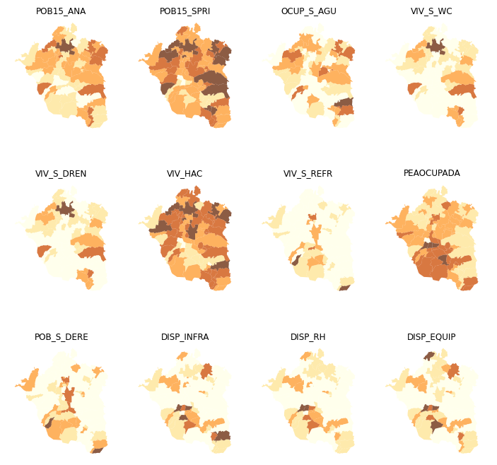
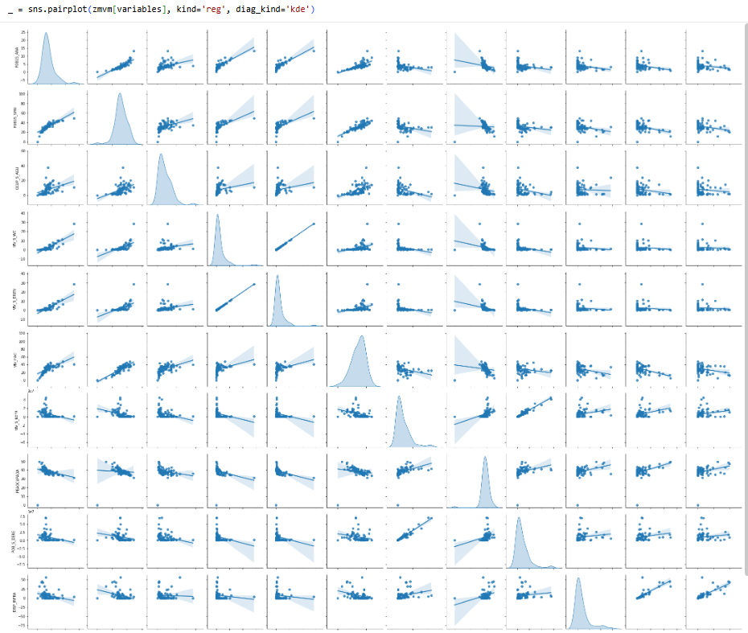
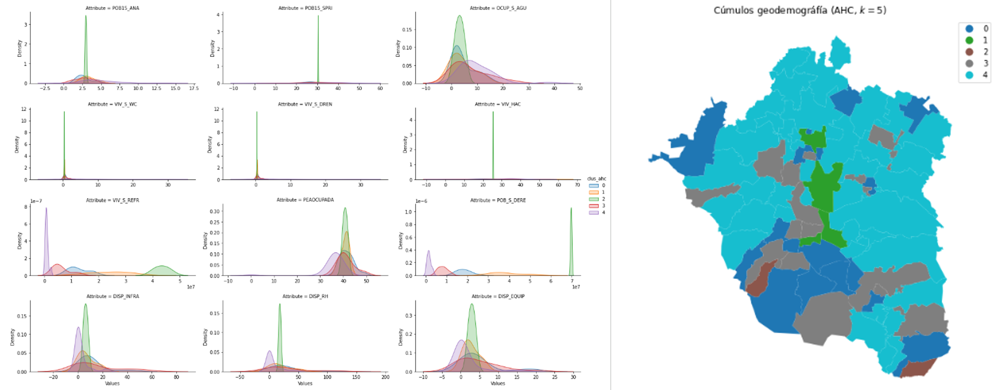
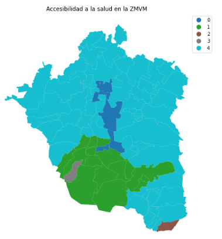

# Accesibilidad a la salud — segmentación territorial (ZMVM)

Repositorio de portafolio con un análisis geoespacial en Python (Google Colab) para identificar **patrones territoriales** asociados a accesibilidad/condiciones vinculadas a la salud en la **Zona Metropolitana del Valle de México (ZMVM)**, usando variables socioespaciales agregadas.

📄 **Reporte completo (PDF):** `docs/report/ZMVM_SALUD_colab.pdf`

> **Nota:** el GeoPackage de trabajo **no se incluye** en este repositorio. Se publican documentación y salidas (figuras) como evidencia del proceso.

---

## Objetivo
- Explorar la distribución espacial de múltiples variables socioespaciales vinculadas a condiciones de vivienda, población y disponibilidad (infraestructura/recursos/equipamiento).
- Identificar **tipologías territoriales** mediante técnicas de agrupamiento (clustering).
- Comparar segmentaciones sin restricción espacial (K-means/AHC) contra **regionalización** (clustering con conectividad espacial) para obtener regiones contiguas.

---

## Insumos (variables)
El análisis integra un conjunto de indicadores como:

- **Población / condiciones:** `POB15_ANA`, `POB15_SPRI`, `PEAOCUPADA`, `POB_S_DERE`  
- **Vivienda/servicios:** `OCUP_S_AGU`, `VIV_S_WC`, `VIV_S_DREN`, `VIV_HAC`, `VIV_S_REFR`  
- **Disponibilidad:** `DISP_INFRA`, `DISP_RH`, `DISP_EQUIP`

> Los nombres provienen del dataset de trabajo; la interpretación específica depende del diccionario de datos del proyecto.

---

## Metodología
1. **Carga y verificación** de datos geoespaciales (GeoPackage) y sistema de referencia (CRS).
2. **Exploración espacial**: mapeo coroplético por variable para observar gradientes y patrones territoriales.
3. **Correlación**: análisis bivariado (pairplot/matriz) para detectar asociaciones entre variables.
4. **K-means (k=5)**:
   - asignación de clústeres,
   - mapeo de categorías,
   - caracterización por clúster (estadísticos descriptivos),
   - distribución de variables por clúster.
5. **Clustering jerárquico aglomerativo (AHC, método Ward, k=5)**:
   - asignación de etiquetas,
   - caracterización y mapeo de clústeres.
6. **Regionalización (restricción espacial / conectividad)**:
   - construcción de pesos espaciales por contigüidad (Queen),
   - corrección de conectividad con KNN en caso de islas/desconexiones,
   - clustering con matriz de conectividad para obtener **regiones contiguas**.

---

## Resultados

### Exploración espacial por variable

### Correlaciones entre variables

### Segmentación por K-means

### Segmentación por clustering jerárquico (AHC - Ward)

### Regionalización (clustering con conectividad espacial)

---

## Lectura de resultados
- La exploración por variable permite identificar **gradientes territoriales** y zonas con concentración de condiciones específicas.
- El análisis de correlación ayuda a detectar **relaciones fuertes** entre indicadores (redundancias y asociaciones).
- K-means y AHC generan tipologías útiles para segmentación, pero pueden producir clústeres **no contiguos**.
- La regionalización incorpora conectividad espacial para obtener regiones **coherentes territorialmente**, facilitando la interpretación y comunicación.

---

## Control de calidad 
- Integridad de claves de unión (IDs de unidad espacial).
- Validación de rangos (por ejemplo, 0–100% en variables porcentuales).
- Revisión de valores faltantes/duplicados.
- Verificación visual espacial (unidades dentro del límite esperado).

---

## Limitaciones
- La interpretación depende de la calidad y definición de las variables disponibles en la base.
- Comparaciones y segmentaciones describen patrones espaciales; **no implican causalidad**.
- La regionalización puede variar con el criterio de conectividad (Queen / KNN) y parámetros de agrupamiento.

---

## Herramientas
- Python (Google Colab)
- GeoPandas / Pandas / NumPy
- Scikit-learn (clustering)
- PySAL (pesos espaciales, conectividad / regionalización)
- Matplotlib / Seaborn (visualización)

---

## Datos y confidencialidad
- El GeoPackage fuente no se publica en este repositorio.
- No se incluyen datos personales identificables; el análisis se realiza con información agregada.

---

## Autora
**María Fernanda González Mora**  

